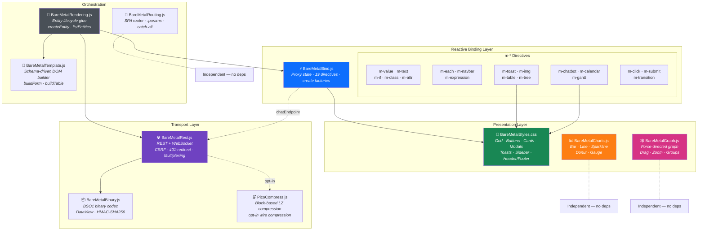

# BareMetalJsTools

Tiny, zero-dependency vanilla-JS primitives for building fully client-rendered apps **without a build step, without a framework**. Extracted from [BareMetalWeb](https://github.com/WillEastbury/BareMetalWeb) so they can be reused, evolved, and tested in isolation.

> All modules are **classic IIFEs** (`const X = (() => {...})()`) that work as drop-in `<script>` tags. ESM wrappers are also provided for bundler / Node use.

---

## Modules

| Module | Size | What it does |
|---|---:|---|
| [`BareMetalBinary`](docs/BareMetalBinary.md)   | 31 KB | BSO1 binary wire serialiser. Zero-copy `DataView` reads, HMAC-SHA256 signing via Web Crypto. |
| [`BareMetalBind`](docs/BareMetalBind.md)       | 8 KB  | Reactive `Proxy` state + 19 `m-*` directives. Forms, lists, toasts, chatbot, calendar, Gantt, tables, trees. `create` factories & `chatEndpoint` auto-wire. |
| [`BareMetalRest`](docs/BareMetalRest.md)       | 16 KB | REST + WebSocket binary transport. Negotiates BMW WS frames → BSO1 → JSON fallback. CSRF, 401-redirect, request multiplexing. |
| [`BareMetalTemplate`](docs/BareMetalTemplate.md) | 14 KB | Schema-driven DOM builder. `buildForm(layout, fields)` and `buildTable(fields, items, callbacks)` produce Bootstrap-compatible markup. |
| [`BareMetalRendering`](docs/BareMetalRendering.md) | 4 KB  | Glues Rest + Bind + Template into an entity lifecycle (`createEntity`, `listEntities`). Also exposes `window.minibind`. |
| [`BareMetalRouting`](docs/BareMetalRouting.md) | 8 KB  | History-API SPA router. Named segments (`:param`) and catch-all (`*`) patterns. Exposed as `window.BMRouter`. |
| [`PicoCompress`](docs/PicoCompress.md)     | 27 KB | Block-based LZ compressor. Zero deps. Byte-identical to the [C reference](https://github.com/WillEastbury/picocompress). Integrated into `BareMetalRest` for opt-in wire compression. |
| [`BareMetalStyles`](docs/BareMetalStyles.md) | 34 KB | Minimal CSS framework. Drop-in Bootstrap 5 subset (~200 classes) covering grid, flexbox, spacing, buttons, forms, tables, cards, modals, alerts, and more. Zero JS required. |
| [`BareMetalCharts`](docs/BareMetalCharts.md) | 17 KB | Lightweight SVG chart renderer. Bar, line, sparkline, donut, and gauge charts. Animated, themed via CSS custom properties. |
| [`BareMetalGraph`](docs/BareMetalGraph.md)   | 19 KB | Force-directed graph visualiser. Interactive node/edge diagrams with drag, zoom, hover highlighting, and dynamic add/remove. |

### Architecture diagram



#### How the pieces connect

| Layer | Modules | Role |
|---|---|---|
| **Presentation** | Styles, Charts, Graph | Visual rendering — CSS framework, SVG charts, force-directed graphs. Zero JS deps. |
| **Reactive Binding** | Bind (19 directives) | Proxy-based state → DOM. Covers forms, lists, toasts, chatbot, calendar, Gantt, tables, trees. `create` factories for each. |
| **Transport** | Rest, Binary, PicoCompress | Server communication — REST/WS with binary BSO1 codec and optional LZ compression. |
| **Orchestration** | Rendering, Template, Routing | Glue layer — entity lifecycle, schema-driven forms/tables, SPA routing. |

> **Key integration:** `BareMetalBind.chatEndpoint()` auto-wires `m-chatbot` to `BareMetalRest` — user messages POST to your API and bot replies are pushed back reactively.

---

## Install

### As a `<script>` tag (the original use case)

```html
<script src="src/picocompress.js"></script>  <!-- optional, for wire compression -->
<script src="src/BareMetalBind.js"></script>
<script src="src/BareMetalRest.js"></script>
<script src="src/BareMetalTemplate.js"></script>
<script src="src/BareMetalRendering.js"></script>
<script src="src/BareMetalRouting.js"></script>
```

Order matters only where dependencies exist — `BareMetalRendering` needs Rest, Bind, Template loaded first.

### As an npm package (Node / bundler)

```bash
npm install github:WillEastbury/BareMetalJsTools
```

```js
import { BareMetalBind, BareMetalRest, BMRouter } from 'baremetal-js-tools';
// or per-module:
import BareMetalRest from 'baremetal-js-tools/rest';
```

---

## Quick start

```js
const { state, watch } = BareMetalBind.reactive({ name: 'World', items: [] });

document.body.innerHTML = `
  <input m-value="name">
  <p>Hello, <span m-text="name"></span>!</p>
  <ul m-each="items key:id">
    <template><li m-text=".text"></li></template>
  </ul>
`;
BareMetalBind.bind(document.body, state, watch);
state.name = 'BareMetal';            // UI updates automatically
state.items.push({ id: 1, text: 'First' }); // reactive array — no reassignment needed
```

```js
BMRouter.on('/users',         () => renderList('user'));
BMRouter.on('/users/:id',     ctx => renderDetail('user', ctx.params.id));
BMRouter.start();
```

```js
BareMetalRest.setRoot('/api/');
const customer = BareMetalRest.entity('customer');
const all      = await customer.list();
const one      = await customer.get(42);
await customer.update(42, { name: 'Acme' });
```

### Opt-in compression (picocompress)

```js
// Load picocompress.js before BareMetalRest.js, then:
BareMetalRest.setCompression({ enabled: true, profile: 'balanced', minSize: 256 });
// All requests > 256 bytes are now picocompress-encoded; responses too if the server supports it.
```

---

## Tests

```bash
npm install
npm test
```

Tests run under Node + `jest-environment-jsdom`. Each module is loaded via `new Function(...)` so globals (`fetch`, `document`, ...) can be mocked per test.

| File | Coverage |
|---|---|
| `tests/BareMetalBind.test.js`       | `reactive()`, all `m-*` directives, dot-paths, formatters, reactive arrays, keyed diffing, scoped m-each, transitions, expressions |
| `tests/BareMetalRest.test.js`       | `setRoot`/`getRoot`, CRUD, fetch errors, CSRF, FormData |
| `tests/BareMetalTemplate.test.js`   | `buildForm` field types, layout, lookup; `buildTable` cells, callbacks, badges |
| `tests/BareMetalRouting.test.js`    | Pattern matching, params, query parsing, `navigate()` |
| `tests/BareMetalRendering.test.js`  | `createEntity`, `listEntities`, `renderUI`, lookup hydration, `window.minibind` |
| `tests/BareMetalRest.compression.test.js` | `setCompression`/`getCompression`, outgoing compression, response decompression |
| `tests/picocompress.test.js`       | IIFE wrapper, round-trip, profiles, `compressBound` |

`BareMetalBinary` does not yet have unit tests — contributions welcome.

---

## Design philosophy

* **No build step.** No webpack, no rollup, no TypeScript compile. Save and refresh.
* **No framework.** No virtual DOM. The browser already has one.
* **No runtime dependencies.** Everything is plain ES2017+ that runs in any modern browser.
* **Composable, not monolithic.** Use any one module in isolation; combine for full SPAs.
* **Server-driven UI.** Forms and tables are produced from metadata sent by the server, not hand-rolled per page.

---

## License

MIT — see [LICENSE](./LICENSE).

Originally extracted from [BareMetalWeb](https://github.com/WillEastbury/BareMetalWeb) and maintained separately for reuse.
