# BareMetalJsTools

> *586 KB minified for a complete reactive UI framework, CSS toolkit, binary serialisation, schema validation, compression, transport layer (retry/circuit-breaker/cache), OAuth/OIDC auth, session management, crypto, offline-first PWA, routing, charting, graph visualisation, validation, i18n, state machines, animation, drag-and-drop, accessibility, structured logging, JWT handling, 50+ regex patterns, ISO reference data, RBAC, a workflow engine, Markdown renderer, protocol compiler with IDE, clipboard, file I/O, notifications, pub/sub, undo/redo, IndexedDB, worker pool, forms, geolocation, camera/media, payments, observers, speech, gamepad, sync/CRDTs, URL utilities, capability detection, caching, async pipelines, diagnostics, config management, and a runtime type system. Most people pull in more than that just for a toast notification library.*

Modern web development has become absurdly complicated. You need a bundler, a transpiler, a framework, a meta-framework, a state manager, a CSS-in-JS solution, and forty-seven config files before you can render "Hello World". Then you wait for it to compile.

**This toolkit takes a different approach: just host some damn files.**

BareMetalJsTools is a collection of tiny, zero-dependency vanilla-JS modules that give you reactive UI, REST transport, SPA routing, charts, and a full CSS framework — all as plain `<script>` tags. No build step. No compile phase. No node_modules black hole. Save your file, refresh your browser, and get on with your life.

Every module follows the same pattern: small, obvious, fast. You can read the source in one sitting. You can understand what it does without a tutorial series. And because there's nothing to build, your deploy is just... serving files. *How* you serve them matters — cache headers, compression, CDN — but the point is your toolchain stays out of your way.

> [**The hard part is serving your files well**](https://github.com/willeastbury/picoweb)

> Extracted from [BareMetalWeb](https://github.com/WillEastbury/BareMetalWeb) and maintained separately so each piece can be reused, evolved, and tested in isolation.

---

## The BareMetal family

This toolkit doesn't exist in isolation. The same "strip away the nonsense" philosophy runs through the entire stack:

| Project | What it is |
|---|---|
| [**BareMetalJsTools**](https://github.com/WillEastbury/BareMetalJsTools) | This repo. Reactive UI, REST transport, SPA routing, charts, CSS framework — all as plain `<script>` tags. This is what happens when you apply the philosophy to *the browser*. |
| [**BareMetalWeb**](https://github.com/WillEastbury/BareMetalWeb) | The web server and application framework this toolkit was extracted from. A minimal, metadata-driven .NET web host that serves these JS modules and renders server-driven UI — absolute lightning, but it's the only component in the stack that won't run on a tiny RPi Pico 2W. C port incoming. |
| [**PicoWeb**](https://github.com/willeastbury/picoweb) | The hard part is serving your files well. A tiny, fast web server that does exactly that — static files, cache headers, compression, and nothing else. This is what happens when you apply it to *the web server*. |
| [**PicoWAL**](https://github.com/WillEastbury/PicoWAL) | A write-ahead-log database engine built from scratch. Binary schema cards, Pack-0 wire format, embedded storage — no ORM, no query planner committee meetings. This is what happens when you apply it to the *database*. |
| [**picocompress**](https://github.com/WillEastbury/picocompress) | Block-based LZ compression in pure C and JS (byte-identical output). Integrated into `BareMetal.Rest` for opt-in wire compression. This is what happens when you apply it to *data on the wire*. |
| [**RP2350B_Bitnet**](https://github.com/WillEastbury/RP2350B_Bitnet) | A 1-bit quantised SLM that runs on a Raspberry Pi Pico 2 with 512 KB of RAM. This is what happens when you apply it to *machine learning* — and refuse to accept that "AI" requires a data centre, or a GPU, or even a proper desktop or laptop computer. |
| [**PiOS**](https://github.com/WillEastbury/PiOS) | A bare-metal operating system for the Pi 5. This is what happens when you apply it to *the OS itself*. Requires Pi 5 for now — but if we can get it small enough, who knows. |

The whole point is the same everywhere: understand what the machine actually needs to do, throw away everything that doesn't serve that goal, and keep the result small enough that one person can hold the entire system in their head.

---

## What's in the box

| Module | What it does | Source | Min | Nearest equivalent for the not-quite-insane |
|---|---|---|---|---|
| [`BareMetal.Styles`](docs/BareMetal.Styles.md) | CSS framework. Grid, flex, buttons, forms, tables, cards, modals, alerts, toasts — all with short class names optimised for wire size. Zero JS. | [58 KB](src/BareMetalStyles.css) | [42 KB](src/BareMetalStyles.min.css) | *Bootstrap (227 KB)*, Tailwind (≈300 KB+), Fabric UI (≈350 KB), React (≈140 KB) |
| [`BareMetal.Styles.BootstrapCompatibilityShim`](src/BareMetal.Styles.BootstrapCompatibilityShim.css) | Drop-in Bootstrap 5 class-name compatibility. Use standard Bootstrap classes (`.btn`, `.card`, `.row`, `.col-md-6`, etc.) without loading Bootstrap itself. Optional — only needed if migrating from Bootstrap. | [29 KB](src/BareMetal.Styles.BootstrapCompatibilityShim.css) | [24 KB](src/BareMetal.Styles.BootstrapCompatibilityShim.min.css) | *Bootstrap 5 (227 KB)* — this replaces it at 1/9th the size |
| Themes | Swap the colour palette with a single `<link>`. ~800 bytes source, ~600 bytes min each. | | | *Bootswatch (≈8 KB per theme)* |

**Available themes** (`src/themes/`):

| Theme | Vibe | File |
|-------|------|------|
| `base` | Clean white, soft greys, gentle blue | [base.css](src/themes/base.css) |
| `bedlam` | Dark cyberpunk — neon purples & teals | [bedlam.css](src/themes/bedlam.css) |
| `wavefunction` | Dark scientific — deep slate & electric indigo | [wavefunction.css](src/themes/wavefunction.css) |
| `lava` | Fiery dark — molten oranges on volcanic black | [lava.css](src/themes/lava.css) |
| `candy` | Soft candy pink — pastels & lilacs on warm white | [candy.css](src/themes/candy.css) |

```html
<!-- Load core + optional theme (after core, overrides :root vars) -->
<link href="BareMetalStyles.min.css" rel="stylesheet">
<link href="themes/bedlam.min.css" rel="stylesheet">
```

**Bundled fonts** (`src/fonts/`) — load [`fonts.css`](src/fonts/fonts.css) for `@font-face` declarations:

| Font | Type | Size | Use case |
|------|------|------|----------|
| `BareMetalMono` | JetBrains Mono subset | 17 KB | Code, data, terminals |
| `BareMetalSans` | Inter subset | 14 KB | Clean body text, UI |
| `BareMetalPixel` | Silkscreen subset | 2.7 KB | Retro, IoT, tiny displays |
| `Wavefunction-Sans` | Source Sans 3 subset | 27 KB | Versatile modern sans-serif |
| `Wavefunction-Curly` | Dancing Script subset | 28 KB | Flowing handwriting/calligraphy |
| `Wavefunction-Serif` | Source Serif 4 subset | 28 KB | Professional typeset (Times-like) |

```html
<!-- Load fonts (optional — themes reference them via --bs-font-sans) -->
<link href="fonts/fonts.min.css" rel="stylesheet">
<link href="BareMetalStyles.min.css" rel="stylesheet">
<link href="themes/wavefunction.min.css" rel="stylesheet">
```

| Module | What it does | Source | Min | Nearest equivalent for the not-quite-insane |
|---|---|---|---|---|
| [`BareMetal.Bind`](docs/BareMetal.Bind.md) | Reactive `Proxy` state + `m-*` directives. Two-way forms, lists, toasts, chatbot, calendar, Gantt charts, sortable tables, tree views. | [13 KB](src/BareMetal.Bind.js) | [6 KB](src/BareMetal.Bind.min.js) | Vue.js (≈40 KB min), Alpine.js (≈15 KB), Rivets.js ❤️, *Knockout.js ❤️*, TinyBind 💕 |
| [`BareMetal.Components`](docs/BareMetal.Components.md) | Widget directives (m-img, m-toast, m-chatbot, m-calendar, m-gantt, m-table, m-tree, m-entity) that extend Bind. | [25 KB](src/BareMetal.Components.js) | [13 KB](src/BareMetal.Components.min.js) | PrimeVue, Vuetify, Material UI (hundreds of KB each) |
| [`BareMetal.ComponentFactories`](docs/BareMetal.ComponentFactories.md) | `create.*` helpers and `chatEndpoint()` auto-wire for REST-backed chatbots. | [2 KB](src/BareMetal.ComponentFactories.js) | [1 KB](src/BareMetal.ComponentFactories.min.js) | *Hand-rolled boilerplate* |
| [`BareMetal.Template`](docs/BareMetal.Template.md) | Schema-driven DOM builder. Hand it metadata, get a form or table back. | [7 KB](src/BareMetal.Template.js) | [4 KB](src/BareMetal.Template.min.js) | Formly (≈80 KB), *JSON Forms (≈200 KB)* |
| [`BareMetal.Metadata`](docs/BareMetal.Metadata.md) | Client-side entity schema registry. Inline JSON, server fetch, or PicoWAL binary — declare your entities and render them automatically. | [8 KB](src/BareMetal.Metadata.js) | [4 KB](src/BareMetal.Metadata.min.js) | *GraphQL schema* + codegen toolchain |
| [`BareMetal.Communications`](docs/BareMetal.Communications.md) | REST + WebSocket transport. Negotiates WS binary frames → BSO1 → JSON fallback. CSRF, 401-redirect, request multiplexing. | [19 KB](src/BareMetal.Communications.js) | [8 KB](src/BareMetal.Communications.min.js) | Axios (≈14 KB) + *socket.io-client* (≈45 KB) |
| [`BareMetal.Binary`](docs/BareMetal.Binary.md) | BSO1 binary wire serialiser. Zero-copy `DataView` reads, HMAC-SHA256 signing via Web Crypto. | [23 KB](src/BareMetal.Binary.js) | [14 KB](src/BareMetal.Binary.min.js) | Protocol Buffers JS (≈230 KB), *MessagePack (≈25 KB)* |
| [`BareMetal.Compress`](docs/BareMetal.Compress.md) | Block-based LZ compressor. Byte-identical to the [C reference](https://github.com/WillEastbury/picocompress). Opt-in wire compression for Rest. | [19 KB](src/BareMetal.Compress.js) | [8 KB](src/BareMetal.Compress.min.js) | Brotli.js (≈300 KB), *HeatShrink (≈8 KB)* |
| [`BareMetal.Rendering`](docs/BareMetal.Rendering.md) | Glue layer — wires Rest + Bind + Template into an entity lifecycle (`createEntity`, `listEntities`). | [4 KB](src/BareMetal.Rendering.js) | [1 KB](src/BareMetal.Rendering.min.js) | *Custom Redux middleware* + React container layer |
| [`BareMetal.Routing`](docs/BareMetal.Routing.md) | History-API SPA router. Named segments (`:param`), catch-all (`*`), query parsing. | [7 KB](src/BareMetal.Routing.js) | [2 KB](src/BareMetal.Routing.min.js) | *vue-router (≈18 KB)*, react-router (≈30 KB) |
| [`BareMetal.Charts`](docs/BareMetal.Charts.md) | SVG charts — bar, line, sparkline, donut, gauge. Animated, themeable via CSS custom properties. | [16 KB](src/BareMetal.Charts.js) | [8 KB](src/BareMetal.Charts.min.js) | *Chart.js (≈200 KB)*, D3 (≈250 KB) |
| [`BareMetal.Graph`](docs/BareMetal.Graph.md) | Force-directed graph visualiser. Drag, zoom, hover, dynamic add/remove. | [18 KB](src/BareMetal.Graph.js) | [9 KB](src/BareMetal.Graph.min.js) | D3-force (≈30 KB) + D3-selection (≈20 KB), *Cytoscape.js* (≈600 KB) |
| [`BareMetal.Auth`](docs/BareMetal.Auth.md) | OIDC/OAuth2 PKCE client. Silent refresh, provider presets (Google, Microsoft, GitHub, Apple, Facebook), login/whoami UI components. | [28 KB](src/BareMetal.Auth.js) | [16 KB](src/BareMetal.Auth.min.js) | *oidc-client-ts (≈80 KB)*, Auth0 SPA SDK (≈60 KB) |
| [`BareMetal.Crypto`](docs/BareMetal.Crypto.md) | Web Crypto wrapper. AES-256-GCM symmetric, RSA-OAEP hybrid envelope, ECDSA P-256 signing, PBKDF2 key derivation. | [5 KB](src/BareMetal.Crypto.js) | [3 KB](src/BareMetal.Crypto.min.js) | *Stanford JS Crypto (≈45 KB)*, tweetnacl (≈7 KB) |
| [`BareMetal.LocalKVStore`](docs/BareMetal.LocalKVStore.md) | Key-value store abstraction. localStorage, sessionStorage, IndexedDB backends with TTL, namespacing, cross-tab sync. | [14 KB](src/BareMetal.LocalKVStore.js) | [7 KB](src/BareMetal.LocalKVStore.min.js) | *localForage (≈29 KB)*, idb-keyval (≈1 KB) |
| [`BareMetal.Progressive`](docs/BareMetal.Progressive.md) | PWA helper. Service worker registration, install prompts, offline request queue, push notifications, manifest generation. | [10 KB](src/BareMetal.Progressive.js) | [5 KB](src/BareMetal.Progressive.min.js) | *Workbox (≈60 KB)*, PWA Builder |
| [`BareMetal.ServiceWorker`](docs/BareMetal.ServiceWorker.md) | Configurable service worker. CacheFirst, NetworkFirst, StaleWhileRevalidate strategies, precache, background sync. | [7 KB](src/BareMetal.ServiceWorker.js) | [4 KB](src/BareMetal.ServiceWorker.min.js) | *Workbox SW (≈15 KB)* |
| [`BareMetal.Time`](docs/BareMetal.Time.md) | Date/time library. Format, parse, add/subtract, diff, durations, relative time, timezone support, Temporal API bridge. | [12 KB](src/BareMetal.Time.js) | [7 KB](src/BareMetal.Time.min.js) | *Day.js (≈7 KB)*, date-fns (≈75 KB), Moment.js (≈290 KB) |
| [`BareMetal.Validate`](docs/BareMetal.Validate.md) | Schema validation. Required, type, min/max, pattern, nested objects, arrays, custom rules, error objects with path+code+message. | [4 KB](src/BareMetal.Validate.js) | [3 KB](src/BareMetal.Validate.min.js) | *Yup (≈40 KB)*, Joi (≈150 KB), Zod (≈14 KB) |
| [`BareMetal.I18n`](docs/BareMetal.I18n.md) | Internationalisation. Locale fallback chains, ICU plural rules via `Intl.PluralRules`, interpolation, number/date formatting. | [5 KB](src/BareMetal.I18n.js) | [3 KB](src/BareMetal.I18n.min.js) | *i18next (≈40 KB)*, FormatJS (≈30 KB) |
| [`BareMetal.StateMachine`](docs/BareMetal.StateMachine.md) | Finite state machine. States, transitions, guards, actions, context, subscribe/unsubscribe. | [3 KB](src/BareMetal.StateMachine.js) | [1 KB](src/BareMetal.StateMachine.min.js) | *XState (≈50 KB)*, Robot (≈4 KB) |
| [`BareMetal.Logger`](docs/BareMetal.Logger.md) | Structured logging. Levels, transports (console, beacon, custom), batching, safe circular-ref stringify, child loggers. | [5 KB](src/BareMetal.Logger.js) | [3 KB](src/BareMetal.Logger.min.js) | *Winston (≈80 KB)*, Pino (≈30 KB), loglevel (≈3 KB) |
| [`BareMetal.Animate`](docs/BareMetal.Animate.md) | CSS transition/animation helper. Enter/leave, stagger, spring, respects `prefers-reduced-motion`, timeout fallback. | [8 KB](src/BareMetal.Animate.js) | [4 KB](src/BareMetal.Animate.min.js) | *Framer Motion (≈120 KB)*, GSAP (≈60 KB), animate.css (≈80 KB) |
| [`BareMetal.TestRunner`](docs/BareMetal.TestRunner.md) | In-browser test runner. describe/it/expect, async, hooks, mocks, grep, bail, retry, TAP + Markdown reporters. | [24 KB](src/BareMetal.TestRunner.js) | [13 KB](src/BareMetal.TestRunner.min.js) | *Jest (≈1 MB)*, Mocha (≈100 KB), uvu (≈6 KB) |
| [`BareMetal.DragDrop`](docs/BareMetal.DragDrop.md) | Pointer-event drag & drop. Sortable lists, drop zones, constraints, touch support, `setPointerCapture`. | [11 KB](src/BareMetal.DragDrop.js) | [6 KB](src/BareMetal.DragDrop.min.js) | *SortableJS (≈40 KB)*, dnd-kit (≈45 KB), Draggable (≈80 KB) |
| [`BareMetal.A11y`](docs/BareMetal.A11y.md) | Accessibility helpers. Focus traps, live regions, skip links, roving tabindex, keyboard navigation, ARIA attribute management. | [9 KB](src/BareMetal.A11y.js) | [5 KB](src/BareMetal.A11y.min.js) | *focus-trap (≈10 KB)*, ally.js (≈130 KB) |
| [`BareMetal.Expressions`](docs/BareMetal.Expressions.md) | 50+ pre-built regex patterns. Email, phone, URL, postal codes, credit card, UUID, semver, JWT, dates, and more. `test()`, `extract()`, `detect()`, `register()`. | [25 KB](src/BareMetal.Expressions.js) | [17 KB](src/BareMetal.Expressions.min.js) | *validator.js (≈60 KB)*, regex collections scattered across Stack Overflow |
| [`BareMetal.Tokens`](docs/BareMetal.Tokens.md) | JWT library. Create, sign (HS256/384/512, RS256, ES256), verify, decode, inspect. Fluent builder, PEM/JWK import, key generation via Web Crypto. | [20 KB](src/BareMetal.Tokens.js) | [10 KB](src/BareMetal.Tokens.min.js) | *jsonwebtoken (≈30 KB + deps)*, jose (≈100 KB) |
| [`BareMetal.Codes`](docs/BareMetal.Codes.md) | Reference data. Countries (250), currencies, languages, timezones, HTTP status codes, MIME types, CSS colours, card types, units. Lazy-parsed compact encoding. | [28 KB](src/BareMetal.Codes.js) | [29 KB](src/BareMetal.Codes.min.js) | *country-data (≈200 KB)*, i18n-iso-countries (≈100 KB), scattered npm packages |
| [`BareMetal.RBAC`](docs/BareMetal.RBAC.md) | Client-side role/permission UI hints. Reads JWT from storage/cookie, checks roles, groups, permissions, scopes. DOM attribute processing. **UI hints only — enforce server-side.** | [19 KB](src/BareMetal.RBAC.js) | [9 KB](src/BareMetal.RBAC.min.js) | *CASL (≈30 KB)*, casbin.js (≈50 KB), custom middleware |
| [`BareMetal.Workflow`](docs/BareMetal.Workflow.md) | Minimal workflow engine. SET/IF/ELSE/FOR/FOREACH/FOREACHP/WEB/LOAD/SAVE/LOG/WAIT/CALL. Registry, JSON serialization, visual designer component. | [23 KB](src/BareMetal.Workflow.js) | [12 KB](src/BareMetal.Workflow.min.js) | *n8n (massive)*, Camunda (enterprise), custom state machines |
| [`BareMetal.Markdown`](docs/BareMetal.Markdown.md) | GFM Markdown-to-HTML renderer. Headings, lists, tables, code blocks, inline formatting, TOC, front matter, custom renderers, sanitize mode. | [18 KB](src/BareMetal.Markdown.js) | [11 KB](src/BareMetal.Markdown.min.js) | *marked.js (≈39 KB)*, markdown-it (≈100 KB), showdown (≈70 KB) |
| [`BareMetal.PicoScript`](docs/BareMetal.PicoScript.md) | Protocol compiler. BASIC-style DSL → bytecode → jump graph. Event-driven dispatch (ON DATA/TICK/CONNECT/CLOSE), EMIT/PEEK wire primitives, CFG extraction, safety rails, trace. Cross-compiles to C# and C. | [107 KB](src/BareMetal.PicoScript.js) | [51 KB](src/BareMetal.PicoScript.min.js) | *No real equivalent* — custom protocol compilers are bespoke |
| [`BareMetal.PicoScript.Editor`](docs/BareMetal.PicoScript.Editor.md) | 4-pane protocol compiler IDE. Source → Bytecode IR → Jump Graph (SVG CFG) → Trace + Emit output. Linked highlighting, step debugging, breakpoints, dark/light themes. | [31 KB](src/BareMetal.PicoScript.Editor.js) | [31 KB](src/BareMetal.PicoScript.Editor.min.js) | *CodeMirror (≈500 KB)*, Monaco (≈5 MB) |
| [`BareMetal.Clipboard`](docs/BareMetal.Clipboard.md) | Clipboard API wrapper. Read/write text/HTML/images, paste intercept, copy-with-feedback, legacy execCommand fallback. | [8 KB](src/BareMetal.Clipboard.js) | [7 KB](src/BareMetal.Clipboard.min.js) | *clipboard.js (≈7 KB)* |
| [`BareMetal.Speech`](docs/BareMetal.Speech.md) | Web Speech API wrapper. Speech synthesis, recognition sessions, voice commands, dictation, queued utterances. | [8 KB](src/BareMetal.Speech.js) | [6 KB](src/BareMetal.Speech.min.js) | *react-speech-recognition (≈30 KB)*, *annyang (≈13 KB)* |
| [`BareMetal.FileIO`](docs/BareMetal.FileIO.md) | File System Access API + fallbacks. Open/save picker, drag-drop zones, chunked reading, download, format utilities. | [12 KB](src/BareMetal.FileIO.js) | [9 KB](src/BareMetal.FileIO.min.js) | *FileSaver.js (≈5 KB)* + *Dropzone (≈95 KB)* |
| [`BareMetal.Notify`](docs/BareMetal.Notify.md) | Toast/banner queue + Notification API. info/success/warning/error types, progress bars, stacking, auto-dismiss, dark/light themes. | [11 KB](src/BareMetal.Notify.js) | [11 KB](src/BareMetal.Notify.min.js) | *Toastr (≈8 KB)*, notyf (≈15 KB), react-hot-toast (≈30 KB) |
| [`BareMetal.PubSub`](docs/BareMetal.PubSub.md) | Event bus. Wildcard topics (*/\*\*), namespaces, sticky/replay, typed channels, request/response, middleware. | [10 KB](src/BareMetal.PubSub.js) | [4 KB](src/BareMetal.PubSub.min.js) | *EventEmitter3 (≈3 KB)*, mitt (≈1 KB), postal.js (≈20 KB) |
| [`BareMetal.UndoRedo`](docs/BareMetal.UndoRedo.md) | Command pattern undo/redo. Grouping, snapshots, checkpoints, serialization, keyboard binding, event hooks. | [6 KB](src/BareMetal.UndoRedo.js) | [5 KB](src/BareMetal.UndoRedo.min.js) | *Custom implementations* — no dominant library |
| [`BareMetal.IDB`](docs/BareMetal.IDB.md) | Promise-based IndexedDB. CRUD, indexes, range queries, cursors, transactions, batch ops, KV mode, export/import. | [12 KB](src/BareMetal.IDB.js) | [7 KB](src/BareMetal.IDB.min.js) | *idb (≈5 KB)*, Dexie (≈80 KB), localForage (≈30 KB) |
| [`BareMetal.Workers`](docs/BareMetal.Workers.md) | Inline WebWorker pool + scheduler. debounce/throttle, RAF read/write batching, idle queue, priority task queue, retry/timeout. | [9 KB](src/BareMetal.Workers.js) | [9 KB](src/BareMetal.Workers.min.js) | *workerpool (≈20 KB)*, comlink (≈5 KB), lodash.debounce (≈1 KB) |
| [`BareMetal.Geo`](docs/BareMetal.Geo.md) | Geolocation, Haversine distance, bearing, geohash encode/decode, point-in-polygon, bounding box, tracking, geocoding. | [9 KB](src/BareMetal.Geo.js) | [7 KB](src/BareMetal.Geo.min.js) | *geolib (≈30 KB)*, Leaflet (≈170 KB) |
| [`BareMetal.Media`](docs/BareMetal.Media.md) | Camera, microphone, screen capture, MediaRecorder, snapshot, PiP, device enumeration, audio analyser. | [11 KB](src/BareMetal.Media.js) | [8 KB](src/BareMetal.Media.min.js) | *RecordRTC (≈120 KB)*, custom implementations |
| [`BareMetal.Pay`](docs/BareMetal.Pay.md) | Payment Request API, cart management, Luhn card validation, currency formatting, shipping options. | [11 KB](src/BareMetal.Pay.js) | [8 KB](src/BareMetal.Pay.min.js) | *Custom implementations* |
| [`BareMetal.Observe`](docs/BareMetal.Observe.md) | Resize/Intersection/Mutation observers, lazy-load, infinite scroll, sticky detection, breakpoints, animate-on-scroll. | [11 KB](src/BareMetal.Observe.js) | [8 KB](src/BareMetal.Observe.min.js) | *lozad (≈2 KB)*, waypoints (≈8 KB), custom |
| [`BareMetal.Speech`](docs/BareMetal.Speech.md) | Web Speech API: synthesis (speak/queue/pause), recognition (listen/dictate/commands), voice listing. | [8 KB](src/BareMetal.Speech.js) | [6 KB](src/BareMetal.Speech.min.js) | *annyang (≈4 KB)*, custom implementations |
| [`BareMetal.Gamepad`](docs/BareMetal.Gamepad.md) | Gamepad API: polling, deadzone, button/axis events, haptics, combos, profiles (Xbox/PS), normalization. | [11 KB](src/BareMetal.Gamepad.js) | [8 KB](src/BareMetal.Gamepad.min.js) | *gamepad.js (≈10 KB)*, custom |
| [`BareMetal.Forms`](docs/BareMetal.Forms.md) | Declarative forms: validation, masks, wizards, repeaters, autosave, conditional fields, JSON→form generation. | [37 KB](src/BareMetal.Forms.js) | [20 KB](src/BareMetal.Forms.min.js) | *Formik (≈45 KB)*, react-hook-form (≈25 KB) |
| [`BareMetal.Transport`](docs/BareMetal.Transport.md) | Retry/backoff, idempotency, request dedup/coalesce, AbortSignal chaining, cache semantics, circuit breaker, rate limiting, priority queue. | [26 KB](src/BareMetal.Transport.js) | [12 KB](src/BareMetal.Transport.min.js) | *axios-retry (≈5 KB)*, p-queue (≈8 KB), opossum (≈15 KB) |
| [`BareMetal.Errors`](docs/BareMetal.Errors.md) | Typed errors: code/category/retryable, causal chains, classify (transient/auth/validation), match routing, serialisation. | [20 KB](src/BareMetal.Errors.js) | [10 KB](src/BareMetal.Errors.min.js) | *Custom implementations* |
| [`BareMetal.Schema`](docs/BareMetal.Schema.md) | Type-safe schemas: parse→validate→transform, coercion, versioning, migration, Binary module alignment (wireType). | [31 KB](src/BareMetal.Schema.js) | [13 KB](src/BareMetal.Schema.min.js) | *zod (≈60 KB)*, ajv (≈120 KB), yup (≈40 KB) |
| [`BareMetal.Sync`](docs/BareMetal.Sync.md) | Truth reconciliation: diff/patch, merge strategies, conflict resolution, offline queue, CRDTs, vector clocks. | [25 KB](src/BareMetal.Sync.js) | [12 KB](src/BareMetal.Sync.min.js) | *automerge (≈300 KB)*, yjs (≈60 KB) |
| [`BareMetal.URL`](docs/BareMetal.URL.md) | URL parse/build, query encode/decode, route params, template, join, normalize, slugify, resolve. | [20 KB](src/BareMetal.URL.js) | [9 KB](src/BareMetal.URL.min.js) | *qs (≈8 KB)*, url-pattern (≈4 KB), slugify (≈3 KB) |
| [`BareMetal.Capabilities`](docs/BareMetal.Capabilities.md) | Feature detection, environment profiling, permissions, fallback trees, progressive degradation, capability scoring. | [23 KB](src/BareMetal.Capabilities.js) | [12 KB](src/BareMetal.Capabilities.min.js) | *Modernizr (≈25 KB)*, custom |
| [`BareMetal.Session`](docs/BareMetal.Session.md) | Session lifecycle, token rotation, multi-tab sync (BroadcastChannel), silent re-auth, activity/idle tracking. | [20 KB](src/BareMetal.Session.js) | [9 KB](src/BareMetal.Session.min.js) | *Custom implementations* |
| [`BareMetal.Cache`](docs/BareMetal.Cache.md) | TTL, SWR, stale-if-error, LRU eviction, tag invalidation, tiered (memory+storage), memoize, stats. | [25 KB](src/BareMetal.Cache.js) | [11 KB](src/BareMetal.Cache.min.js) | *lru-cache (≈8 KB)*, node-cache (≈15 KB) |
| [`BareMetal.Pipeline`](docs/BareMetal.Pipeline.md) | Composable async pipelines, stream transforms (map/filter/reduce/chunk), backpressure, cancellation. | [21 KB](src/BareMetal.Pipeline.js) | [10 KB](src/BareMetal.Pipeline.min.js) | *Highland (≈50 KB)*, RxJS (≈200 KB) |
| [`BareMetal.Diagnostics`](docs/BareMetal.Diagnostics.md) | Trace spans, timeline, perf marks/measures/aggregation, counters, gauges, inspection, module auto-hook. | [25 KB](src/BareMetal.Diagnostics.js) | [11 KB](src/BareMetal.Diagnostics.min.js) | *OpenTelemetry (≈200 KB)*, custom |
| [`BareMetal.Config`](docs/BareMetal.Config.md) | Layered config (defaults/env/runtime/override), schema validation, scoped contexts, freeze, env export/import. | [26 KB](src/BareMetal.Config.js) | [11 KB](src/BareMetal.Config.min.js) | *dotenv (≈5 KB)*, convict (≈30 KB) |
| [`BareMetal.Types`](docs/BareMetal.Types.md) | Runtime type descriptors, registry, contracts, guards, unions/intersections/tuples, reflection, serialize/clone. | [35 KB](src/BareMetal.Types.js) | [18 KB](src/BareMetal.Types.min.js) | *io-ts (≈40 KB)*, runtypes (≈15 KB) |
| **Total** | **The whole toolkit** | **≈1,050 KB** | **≈586 KB** | **≈5,000+ KB** (picking the smaller option from each row) |

### Architecture

```mermaid
graph TB
  subgraph "Presentation"
    Styles["🎨 Styles<br/><i>Grid · Buttons · Cards<br/>Modals · Toasts · Layout</i>"]
    Charts["📊 Charts<br/><i>Bar · Line · Sparkline<br/>Donut · Gauge</i>"]
    Graph["🕸️ Graph<br/><i>Force-directed<br/>Drag · Zoom</i>"]
  end

  subgraph "Reactive Binding"
    Bind["⚡ Bind + Components<br/><i>Proxy state · m-* directives</i>"]
    Factories["🏭 Factories<br/><i>create.* · chatEndpoint</i>"]
    Metadata["📋 Metadata<br/><i>Entity schemas · m-entity</i>"]
  end

  subgraph "Transport"
    Rest["🌐 Communications<br/><i>REST + WebSocket<br/>CSRF · Multiplexing</i>"]
    Binary["📦 Binary<br/><i>BSO1 codec · HMAC</i>"]
    Compress["🗜️ Compress<br/><i>LZ compression</i>"]
  end

  subgraph "Orchestration"
    Rendering["🔧 Rendering<br/><i>Entity lifecycle</i>"]
    Template["📝 Template<br/><i>buildForm · buildTable</i>"]
    Routing["🧭 Routing<br/><i>SPA router</i>"]
  end

  subgraph "Security & Auth"
    Auth["🔐 Auth<br/><i>OIDC · PKCE · Providers</i>"]
    Crypto["🔑 Crypto<br/><i>AES · RSA · ECDSA</i>"]
  end

  subgraph "Offline & PWA"
    Progressive["📱 Progressive<br/><i>SW reg · Install · Push</i>"]
    ServiceWorker["⚙️ ServiceWorker<br/><i>Cache strategies · Sync</i>"]
    KVStore["💾 LocalKVStore<br/><i>KV · TTL · IndexedDB</i>"]
    Time["🕐 Time<br/><i>Format · Relative · TZ</i>"]
  end

  subgraph "Dev & Testing"
    Validate["✅ Validate<br/><i>Schema · Rules · Errors</i>"]
    TestRunner["🧪 TestRunner<br/><i>describe · it · expect</i>"]
    Logger["📝 Logger<br/><i>Levels · Transports · Batch</i>"]
  end

  subgraph "Interaction & UX"
    Animate["🎬 Animate<br/><i>Enter/Leave · Spring</i>"]
    DragDrop["🖱️ DragDrop<br/><i>Pointer · Sortable · Zones</i>"]
    A11y["♿ A11y<br/><i>Focus trap · ARIA · Kbd</i>"]
    I18n["🌍 I18n<br/><i>Locale · Plural · Format</i>"]
    StateMachine["🔄 StateMachine<br/><i>States · Guards · Context</i>"]
  end

  Rendering --> Bind
  Rendering --> Template
  Rendering --> Rest
  Metadata --> Template
  Metadata -.-> Bind
  Metadata -.-> Rest
  Rest --> Binary
  Rest -.->|opt-in| Compress
  Factories -.-> Rest
  Bind --> Styles
  Auth -.-> Rest
  Progressive -.-> Rest
  Progressive -.-> KVStore
  Progressive --> ServiceWorker

  style Bind fill:#0d6efd,color:#fff
  style Styles fill:#198754,color:#fff
  style Rest fill:#6f42c1,color:#fff
  style Charts fill:#fd7e14,color:#fff
  style Graph fill:#d63384,color:#fff
  style Rendering fill:#495057,color:#fff
  style Metadata fill:#20c997,color:#fff
  style Auth fill:#dc3545,color:#fff
  style Crypto fill:#6610f2,color:#fff
  style Progressive fill:#0dcaf0,color:#000
  style ServiceWorker fill:#adb5bd,color:#000
  style KVStore fill:#ffc107,color:#000
  style Time fill:#198754,color:#fff
  style Validate fill:#20c997,color:#000
  style TestRunner fill:#6c757d,color:#fff
  style Logger fill:#adb5bd,color:#000
  style Animate fill:#fd7e14,color:#fff
  style DragDrop fill:#e83e8c,color:#fff
  style A11y fill:#6610f2,color:#fff
  style I18n fill:#17a2b8,color:#fff
  style StateMachine fill:#495057,color:#fff
```



---

## Getting started

### Drop in the scripts

```html
<link rel="stylesheet" href="src/BareMetal.Styles.css">
<script src="src/BareMetal.Bind.js"></script>
<script src="src/BareMetal.Components.js"></script>
<!-- add whichever modules you need — order only matters where dependencies exist -->
```

That's it. No install. No config. No waiting.

### Or use npm (if you must)

```bash
npm install github:WillEastbury/BareMetalJsTools
```

---

## Quick start

### Reactive UI in five lines

```js
const { state, watch } = BareMetal.Bind.reactive({ name: 'World', items: [] });

document.body.innerHTML = `
  <input m-value="name">
  <p>Hello, <span m-text="name"></span>!</p>
`;
BareMetal.Bind.bind(document.body, state, watch);
state.name = 'BareMetal';  // UI updates instantly
```

### SPA routing

```js
BareMetal.Routing.on('/users',     () => renderList('user'));
BareMetal.Routing.on('/users/:id', ctx => renderDetail('user', ctx.params.id));
BareMetal.Routing.start();
```

### REST client

```js
BareMetal.Communications.setRoot('/api/');
const customer = BareMetal.Communications.entity('customer');
const all      = await customer.list();
await customer.update(42, { name: 'Acme' });
```

### Metadata-driven forms

```html
<script type="application/bm-meta">
{ "name": "Customer", "schema": { "fields": {
    "name":  { "type": "text", "label": "Name", "required": true },
    "email": { "type": "Email", "label": "Email" }
  }}, "layout": { "columns": 2, "fields": ["name", "email"] }}
</script>

<div m-entity="customer" m-mode="form"></div>

<script>
  BareMetal.Metadata.scanInline();
  // form is auto-rendered and bound — done.
</script>
```

---

## Tests

```bash
npm install && npm test
```

Tests run under Node + jsdom. Each module is loaded in isolation via `new Function(...)` so globals can be mocked per test.

| Suite | What's covered |
|---|---|
| Bind | `reactive()`, all `m-*` directives, dot-paths, formatters, reactive arrays, keyed diffing, transitions, expressions |
| Rest | CRUD, fetch errors, CSRF, FormData |
| Template | `buildForm` field types, layout, lookup; `buildTable` cells, callbacks, badges |
| Routing | Pattern matching, params, query parsing, `navigate()` |
| Rendering | Entity lifecycle, lookup hydration, `minibind` |
| Compress | Round-trip, profiles, `compressBound` |
| Metadata | Register, get, scanInline, type normalisation, toTemplateFields |

---

## Why this exists

Web development got complicated for no good reason. Somewhere along the way, "make a web page" turned into "configure a seventeen-stage build pipeline, wait for it to compile, debug the bundler, then discover your CSS got tree-shaken into oblivion."

BareMetalJsTools exists because we think that's insane.

* **No build step.** Save the file. Refresh the browser. Done.
* **No framework tax.** No virtual DOM diffing. The browser already has a perfectly good DOM — use it.
* **No dependencies.** Every module is plain ES2017+ that works in any modern browser, right now.
* **Pick what you need.** Use one module or all of them. They compose cleanly but don't demand each other.
* **Server-driven where it counts.** Forms and tables render from metadata — declare your schema, not your markup.
* **Wire-efficient.** Short class names, binary transport, optional LZ compression. Every byte earns its place.

The hard part isn't the JavaScript. The hard part is serving your files well — cache headers, compression, CDN placement, HTTP/2 push. Focus your energy there, not on configuring webpack.

---

## License

MIT — see [LICENSE](./LICENSE).

Extracted from [BareMetalWeb](https://github.com/WillEastbury/BareMetalWeb) and maintained here for independent reuse.
